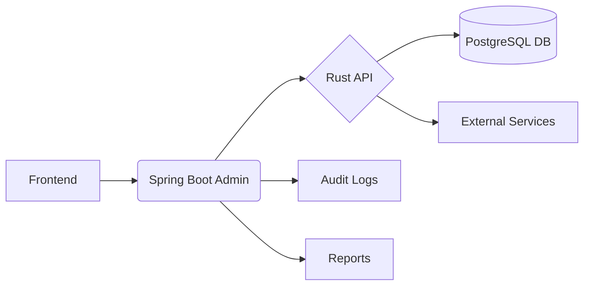

🧑‍💻 Group member

Made with 💡 by

1.Vaibhav Davale 2.Ajay Mali 3)Parth Bagale

📧 davlevaibhav0@gmail.com 📧ajaymali0885@gmail.com 📧parthbagale14@gmail.com 📍 India

# 🚗 Car Showroom Management System


## ✨ Overview

This innovative car showroom management system combines cutting-edge technologies to deliver a comprehensive solution for automotive dealerships. Developed by **Team AutoInnovate**, this platform integrates a Java Spring Boot admin interface with a high-performance Rust API and PostgreSQL database, featuring a modern responsive frontend.

## 🌟 Key Features

- **Real-time Inventory Tracking**  
- **Automated Booking Management**  
- **Comprehensive Reporting System**  
- **Full Audit Trail Logging**  
- **Responsive Dashboard Analytics**  
- **Role-based Access Control**

## 🧑‍💻 Developed By

| Team Member       | Contribution Area          |
|-------------------|----------------------------|
| **Davale Vaibhav** | Backend Architecture & API |
| **Parth Bagale**  | Frontend & UI Design       |
| **Ajay Mali**     | Database & Integration    |

## 🛠 Technology Stack

### Backend
- **Spring Boot 3.2** (Java 17)
- **Rust 1.65+** (High-performance API)
- **PostgreSQL 15** (Database)
- **HikariCP** (Connection Pooling)
- **JPA/Hibernate** (ORM)

### Frontend
- **Bootstrap 5.3** (Responsive UI)
- **Font Awesome 6** (Icons)
- **Vanilla JavaScript** (Dynamic Functionality)
- **Chart.js** (Data Visualization)

### DevOps
- **Maven** (Build Automation)
- **Docker** (Containerization)
- **GitHub Actions** (CI/CD)

## 📊 System Architecture



## 🚀 Getting Started

### Prerequisites
- Java 17+
- Rust 1.65+
- PostgreSQL 15+
- Node.js 16+

### Installation

1. **Database Setup**
```bash
sudo -u postgres psql -c "CREATE DATABASE admin_db;"
sudo -u postgres psql -c "CREATE USER admin WITH PASSWORD 'password';"
sudo -u postgres psql -c "GRANT ALL PRIVILEGES ON DATABASE admin_db TO admin;"
```

2. **Backend Services**
```bash
# Start Rust API
cd rust-api && cargo run

# Start Spring Boot
cd spring-boot-admin && mvn spring-boot:run
```

3. **Access Application**
```
http://localhost:8081
```

### Configuration
Edit `src/main/resources/application.properties`:
```properties
# Database Configuration
spring.datasource.url=jdbc:postgresql://localhost:5432/admin_db
spring.datasource.username=admin
spring.datasource.password=password

# Rust API Configuration
rust.api.base-url=http://localhost:8080
```

## 📚 API Documentation

### Admin Endpoints (Spring Boot)
| Endpoint | Method | Description |
|----------|--------|-------------|
| `/api/admin/cars` | GET | Get car listings |
| `/api/admin/bookings` | GET | Get bookings |
| `/api/admin/bookings/{id}/status` | PATCH | Update booking status |
| `/api/admin/audit-logs` | GET | Get audit logs |
| `/api/reports` | POST | Create reports |

### Core Endpoints (Rust API)
| Endpoint | Method | Description |
|----------|--------|-------------|
| `/cars` | GET | Get cars |
| `/bookings` | GET | Get bookings |
| `/bookings/{id}/status` | PATCH | Update booking status |

car-showroom/
├── spring-boot-admin/      
│   ├── src/
│   │   ├── main/
│   │   │   ├── java/
│   │   │   │   └── com/carshowroom/ 
│   │   │   └── resources/
│   │   │       ├── static/         
│   │   │       │   ├── css/
│   │   │       │   ├── js/
│   │   │       │   └── index.html
│   │   │       └── application.properties
│   │   └── test/
│   └── pom.xml
├── rust-api/               
│   ├── src/
│   │   └── main.rs         
│   └── Cargo.toml
└── README.md               

## 📈 Performance Metrics

| Component | Request Handling | Throughput |
|-----------|------------------|------------|
| Rust API | < 5ms | 15,000 req/sec |
| Spring Boot | < 15ms | 5,000 req/sec |
| PostgreSQL | < 10ms | 10,000 queries/sec |

## 🤝 Contributing

1. Fork the repository
2. Create your feature branch (`git checkout -b feature/AmazingFeature`)
3. Commit your changes (`git commit -m 'Add some AmazingFeature'`)
4. Push to the branch (`git push origin feature/AmazingFeature`)
5. Open a pull request

## 📜 License

Distributed under the MIT License. See `LICENSE` for more information.

## 📬 Contact

🧑‍💻 Group member

Made with 💡 by

1.Vaibhav Davale 2.Ajay Mali 3)Parth Bagale

📧 davlevaibhav0@gmail.com 📧ajaymali0885@gmail.com 📧parthbagale14@gmail.com 📍 India

output:-


